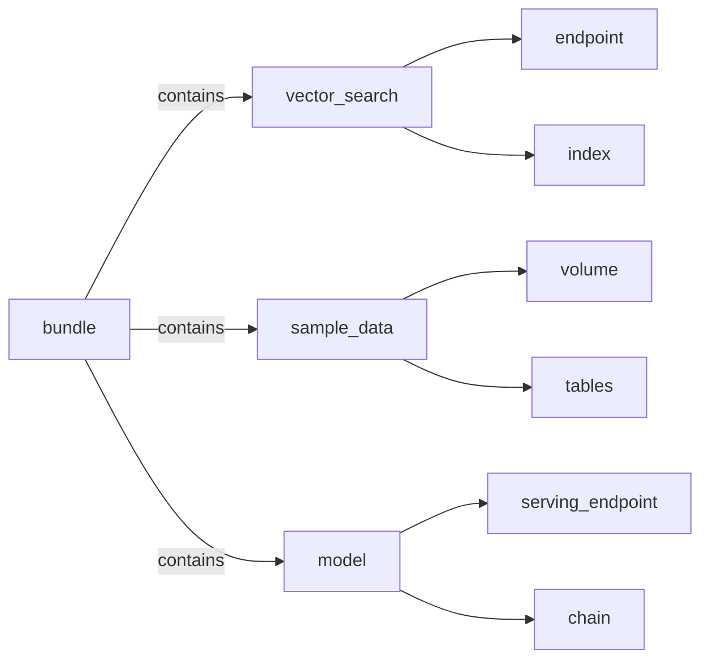

# turbo-mosaic-ai

Build Generative AI solutions rapidly using Mosaic AI on Databricks

```mermaid
flowchart LR;
bundle-->|contains|vector_search;
vector_search-->endpoint;
vector_search-->index;
bundle-->|contains|sample_data;
sample_data-->volume;
sample_data-->tables;
bundle-->|contains|model;
model-->serving_endpoint;
model-->chain;
```