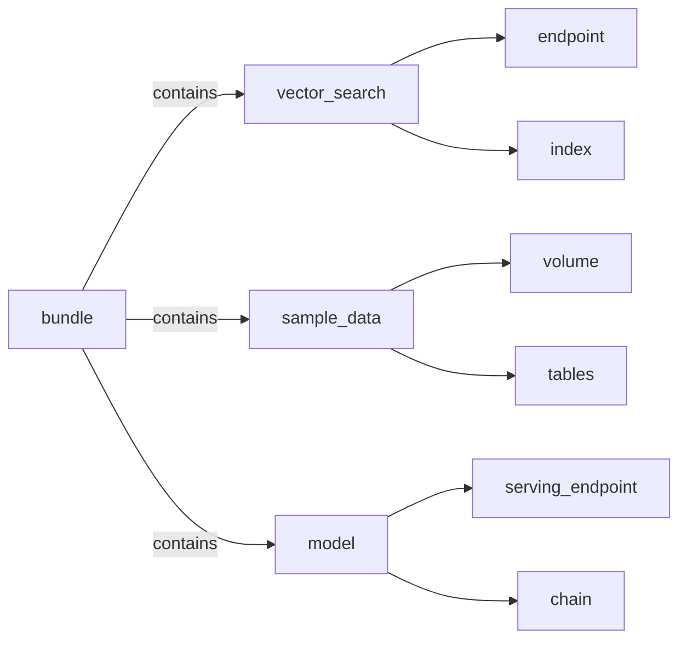

# turbo-mosaic-ai

Build Generative AI solutions rapidly using Mosaic AI on Databricks



This repository contains a Databricks Asset Bundle (DAB) named `turbo_rag` that can be deployed as follows:

Please make sure that you have the latest [Databricks CLI](https://docs.databricks.com/en/dev-tools/cli/install.html) installed. Then configure the CLI as follows:

```bash
databricks configure --profile YOUR_PROFILE
```

Clone the repository and move into the bundle directory:
```bash
git clone git@github.com:vijaybala-db/turbo-mosaic-ai.git
cd turbo-mosaic-ai/turbo_rag
```

Edit the `databricks.yml` configuration file to set the correct `host` for dev, staging and prod.

Validate the bundle as follows:
```bash
databricks bundle validate --profile YOUR_PROFILE
```

If your configuration is correct, you should see the following message: `Validation OK!`
Now deploy the bundle as follows:
```bash
databricks bundle deploy --profile YOUR_PROFILE
```

And run it as follows:
```bash
databricks bundle run --profile YOUR_PROFILE
```